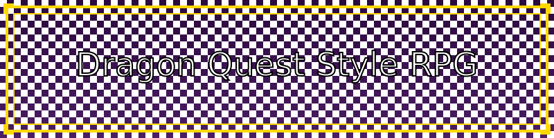

## 📝 概要
シンプルなブラウザベースのRPGゲーム。ドラゴンクエストライクな戦闘システムを実装。

https://github.com/user-attachments/assets/cfdf48b7-e6db-4f17-9d16-8b15ca273586

## ✨ 機能
- 🗺️ 2Dマップ探索
- ⚔️ シンボルエンカウント方式の戦闘システム
- 📱 スマートフォン対応の操作性
- 🎯 シンプルな戦闘コマンド

## 🎮 操作方法
### PC
- 矢印キー：移動
- Enterキー：決定
- メニューボタン：ステータス表示

### スマートフォン
- 画面下部の十字キー：移動
- 決定ボタン：コマンド実行
- メニューボタン：ステータス表示

## 🛠️ 技術スタック
- Python (Flask)
- JavaScript
- HTML5 Canvas
- CSS3

## 💻 セットアップ
1. Replitでプロジェクトを開く
2. 「Run」ボタンをクリック
3. 表示されたURLにアクセス

## 🎨 今後の展望
- NPCとの会話システム
- アイテムシステム
- セーブ/ロード機能
- より複雑な戦闘システム
